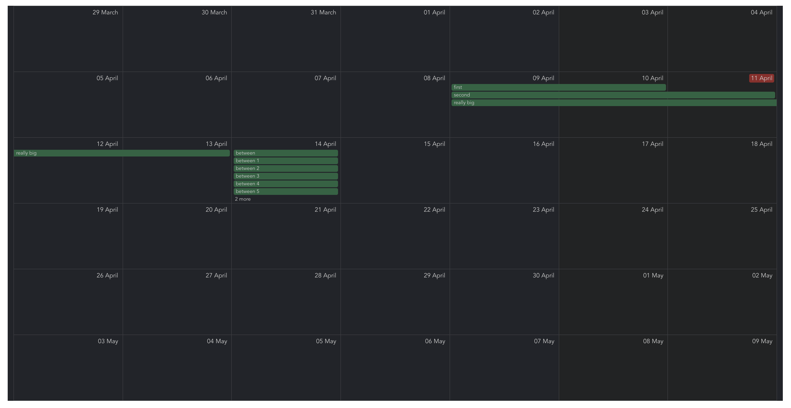

# vue-scheduler



# api example
```html
<Scheduler
  onCellClick="..."
  onCellDoubleClick="..."
  onEventDoubleClick="..."
  onEventClick="..."
  eventDragged="..."
  :events="[
    {
      id: 'event_id',
      from: parseISO('2021-04-09'),
      to: parseISO('2021-04-10'),
      summary: 'Event summary',
    },
  ]"
  month="2021-04"
/>
```
